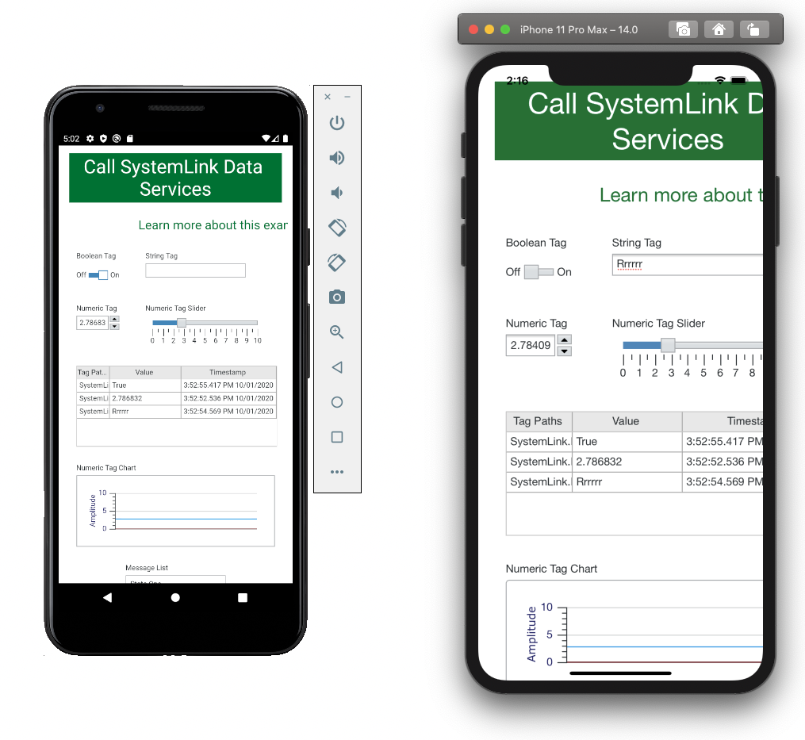
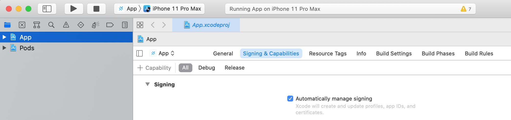
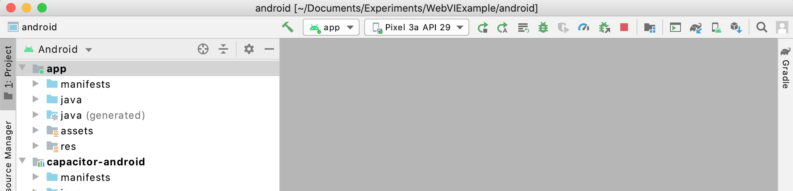

# Wrapping a WebVI as a Native iOS or Android Application

You can use third party tools wrap a WebVI in a thin application shell so that users can install it on their mobile device home screen. This example includes instructions for doing this with the [Capacitor](https://capacitorjs.com/) project.

This approach is useful if you want the app to feel "native" (access to device capabilities and installed via an app store). Progressive Web Apps offer an alternative approach that's simpler to develop but slightly less native.

# Prerequisites
Capacitor works by emitting a project that you can build with the platform's native app development toolchain. This means you'll need to install that toolchain on your development computer and may need to refer to developer training materials from iOS or Android to understand the build workflow and to troubleshoot problems.

To help you understand the complexity, here are a few of the components needed for app development:

- **iOS**: A Mac with the Xcode development environment or an account with a third party service that builds in the cloud. Publishing to the App Store requires a paid Apple Developer account. Apple also offers [ways to distribute apps to a limited set of users](https://help.apple.com/xcode/mac/current/#/devac02c5ab8).

- **Android**: A computer with Android Studio and the Android SDK. Publishing to the Google Play Store requires a Google Developer Account.

# Setup steps 
These are steps you can follow to set up and build a Capacitor application that wraps a WebVI.
1. Install prerequisites
   1. Install the Requirements and platform-specific components from [Capacitor Required Dependencies](https://capacitorjs.com/docs/getting-started/dependencies).
      - *Note:* Running WebVIs in the iOS Simulator requires Xcode 12 or later
   1. Install [LabVIEW NXG](https://www.ni.com/en-us/shop/labview/labview-nxg.html) and the [LabVIEW NXG Web Module](https://www.ni.com/en-us/shop/electronic-test-instrumentation/add-ons-for-electronic-test-and-instrumentation/what-is-labview-nxg-web-module.html) using [NI Package Manager](https://www.ni.com/en-us/support/downloads/software-products/download.package-manager.html#322516).
1. Using NXG, create the WebVI containing your user interface and communication logic.
   1. See *WebVI Best Practices* below for some tips on structuring this application.
1. Build the Web Application that contains your WebVI and locate the build output directory.
   1. To build, open the `.gcomp` containing your WebVI and click the Build icon in its toolbar.
   1. To locate the build output, open the Build Queue pane and click the Locate icon in its toolbar.
   1. You will use this build output to initialize your Capacitor application below.
1. Set up the directory for your Capacitor project.
   1. Create a new directory. It can live next to your WebVI source or elsewhere.
   1. Open a Command Prompt (Windows) or Terminal (MacOS), navigate to that directory, and run the command `npm init`.
      1. If `npm` is not found ensure you installed Node and it added `npm` to your search path.
      1. `npm init` will prompt you for basic configuration. This information is not used by Capacitor and it's ok to enter any values you like if you don't plan to publish the source to NPM. See `capacitor/package.json` in this repo for sample values.
1. Copy the WebVI build output from above to a new directory called `www` within your project folder.
1. Install Capacitor and initialize a project.
   1. Follow the instructions for [Adding Capacitor to an existing web app](https://capacitorjs.com/docs/getting-started#adding-capacitor-to-an-existing-web-app).
   1. Follow the instructions to install whichever desired native platforms you need (iOS, Android).
   1. When this step is complete, your application should look similar to the `capacitor` directory in this repository.
1. Build iOS and Android applications.
   1. Run the steps in [Opening Native Projects](https://capacitorjs.com/docs/basics/opening-native-projects) to launch Xcode or Android Studio with your application.
   1. Use these development environments to run your application in a simulator, deploy it to your mobile device, or build it for distribution to users. One key step to get started is to select your target and run your app using the buttons in the toolbar. For Android you may need to add a simulated device using Android Virtual Device (AVD) Manager. For iOS you may need to configure your signing settings for the project.
   
   
   Workflows beyond this are outside the scope of this example but you can refer to the iOS and Android developer programs for training.

# Update steps
Follow these steps to make changes to the WebVI after setting up the project.
1. Make the changes in NXG and rebuild the `.gcomp`.
1. Copy the files from the build output directory to the `www` directory.
1. From the command line, run the copy commands for your platform as described in [Building your App](https://capacitorjs.com/docs/basics/building-your-app).

1. Call native APIs using JSLI

# WebVI Best Practices
## Connecting to data
You should consider what services your WebVI will communicate with to display data. Options include:
1. Sources available from the public internet (but secured with an API key)
   1. Tags or Messages on SystemLink Cloud
   1. Web Services on a public server
1. Sources available on NI Web Server from your Local Area Network (LAN)
    1. Tags or Messages on SystemLink Server
    1. Web Services on NI Web Server

The app bundle that Capacitor creates includes all of the files generated when you build a WebVI. Capacitor hosts these files on a web server contained within the app. This means that the WebVI will only have access to network resources that are accessible from the mobile device where the app is running.

If your data is available on your LAN you may experience CORS errors when accessing it from the Capacitor application. See the [CORS Errors documentation](https://ionicframework.com/docs/troubleshooting/cors) from Capacitor for suggestions to resolve these.

For more details on this topic, see [Communicating Data with a Web Application](https://www.ni.com/documentation/en/labview-web-module/latest/manual/communicate-data-web-application/).

## Use flexible layout for the WebVI panel
Since the WebVI panel may be presented on screens of different sizes, you should strongly consider setting the WebVI panel to use Flexible Layout. This will automatically adjust the size and position of objects on the panel in response to the size of the screen on which it's displayed.

using their APIs
Investigate cloud service from ioniq
Cordova serve from server. Maybe call APIs
electron
rajsite? ni? self hosted?
need additional experience. this is an example
disable web security in browser within app. https://ionicframework.com/docs/troubleshooting/cors